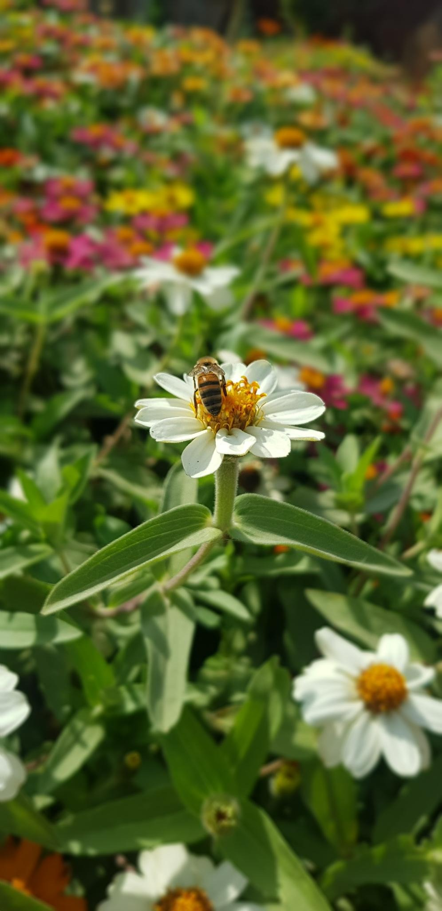
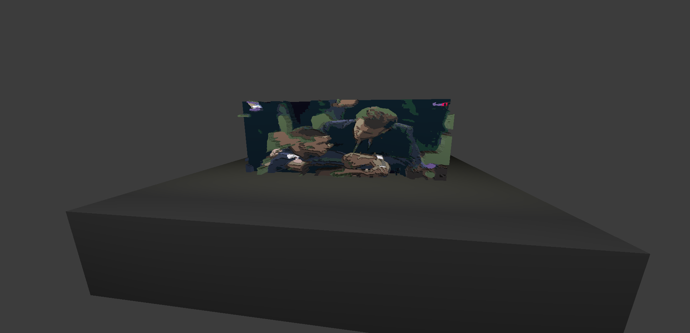

# From Image To Geometries

Transform an image to 3d shapes depending on color. 

## Preview

<table>
  <tr>
    <th>
      Original
    </th>
    <th>
      Converted
    </th>
  </tr>
  <tr>
    <td>
      
    </td>
    <td>
      
    </td>
  </tr>
  
  <tr>
    <td>
      
    </td>
    <td>
      
    </td>
  </tr>
  
    
  <tr>
    <td>
      
    </td>
    <td>
      
    </td>
  </tr>
</table>

